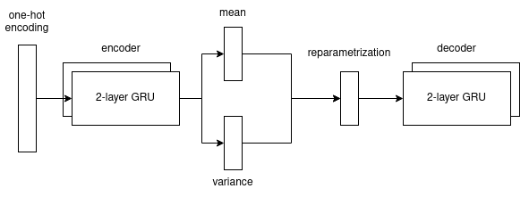

# Latent representations for traditional music analysis and generation

This repository contains the code, data and scripts used to write the Bachelor Thesis "Latent representations for traditional music analysis and generation".

The full text is available [here as a PDF](Latent_representation_for_traditional_music_analysis_and_generation.pdf) and [here on Notion](https://amerotz.notion.site/Latent-representations-for-traditional-music-analysis-and-generation-48204d6646a74b01a2e6e71b6d2aea0f).

This repo contains pre-trained checkpoints of the exact same models that were used in writing the aforementioned work, available in the repsective directories.

This code is based on [timbmg/Sentence-VAE](https://github.com/timbmg/Sentence-VAE).
